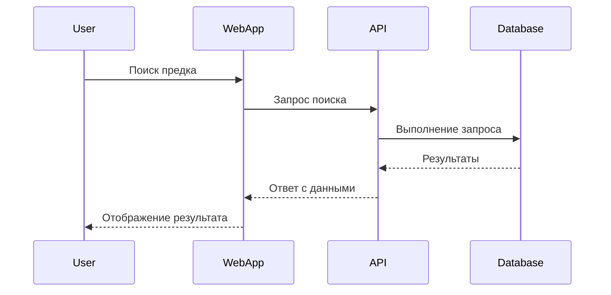
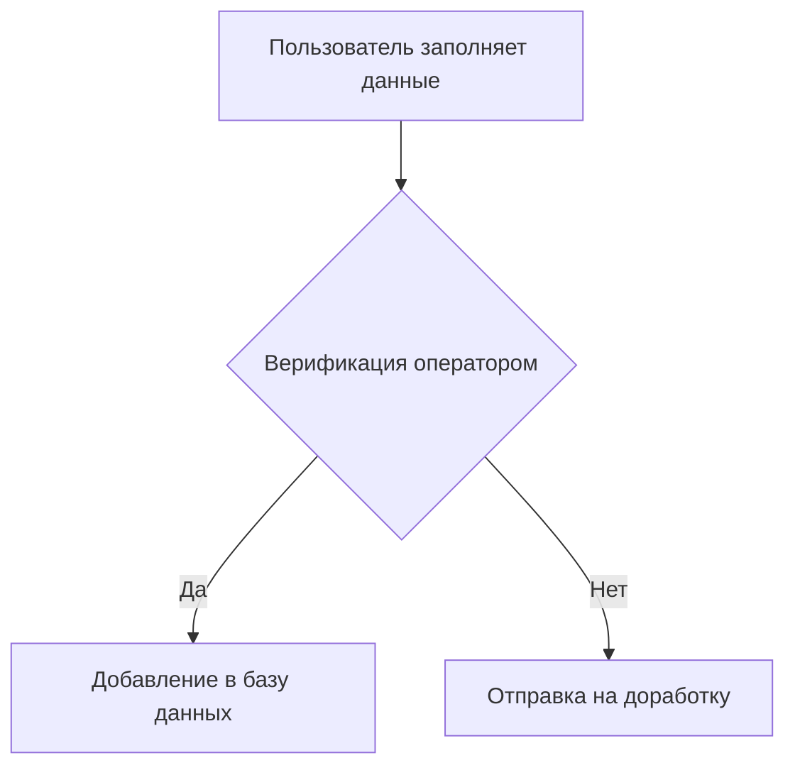
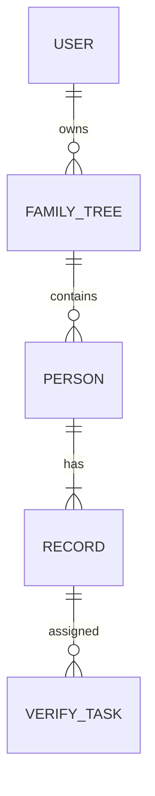

# "Кто твой предок?"

## 1. Общая информация

### a. Версионирование
- Использование семантического версионирования.
- Основные артефакты проекта (API, базы данных и мобильные приложения) версионируются независимо.
- Для API предусмотрено обязательное указание версии в URL (например, `/api/v1/...`).

### b. Трассировка
- Полная трассировка изменений данных (записи событий в аудите).
- Возможность отследить путь данных от исходной записи до пользовательского профиля.
- Все операции пользователей и сторонних приложений логируются и сохраняются.

### c. Глоссарий
| Термин           | Описание |
|------------------|----------|
| Пользователь     | Человек, использующий платформу для поиска или загрузки данных |
| Родословная      | Иерархическая структура предков и потомков |
| Запись           | Оцифрованные исторические документы |
| Верификация      | Процесс подтверждения достоверности записи двумя независимыми операторами |
| API              | Программный интерфейс для взаимодействия сторонних приложений |
| Наблюдаемость    | Способность системы быть мониторируемой и диагностируемой |

## 2. Общие сведения

### a. Проблематика
- Сложность консолидации большого объема исторических данных из различных источников.
- Проверка подлинности загружаемой информации.
- Масштабирование системы на миллионы пользователей и интеграторов.
- Обеспечение высокой доступности и скорости работы.

### b. Цель
- Построение крупнейшего в мире генеалогического графа.
- Предоставление возможности пользователям находить, редактировать и верифицировать семейные связи.
- Предоставление API для сторонних разработчиков.

### c. Краткая информация - что нужно сделать
- Разработать масштабируемую, отказоустойчивую платформу.
- Реализовать API с высокой пропускной способностью.
- Интеграция с ВКонтакте и другими соцсетями.
- Автоматизация процесса загрузки, верификации и поиска записей.

## 3. Изменения в архитектуре системы

- Использование подхода C4 Model для проектирования архитектуры:
  - **Context**: Взаимодействие пользователей, приложений и API.
  - **Container**: Разделение на мобильное приложение, API-серверы, базы данных, систему хранения документов.
  - **Component**: Микросервисы для управления пользователями, родословными, историческими записями, авторизацией и верификацией.
  - **Code**: Стандарты кодирования, CI/CD пайплайны, автоматические тесты.

## 4. Процесс AS-IS

- Разрозненные генеалогические сервисы без единой платформы.
- Отсутствие верификации исторических данных.
- Низкий уровень интеграции с соцсетями и мобильными устройствами.

## 5. Процесс TO-BE

- Централизованная платформа хранения и обработки данных.
- Стандартизированные процессы верификации записей.
- Мобильное приложение для удобного доступа к данным.
- Расширенная интеграция через API и соцсети.

## 6. ФТ

### a. Интерфейсы
- REST API
- WebSocket для событийных подписок
- OAuth 2.0 для аутентификации

### b. Диаграммы

#### i. Sequence

#### ii. BPMN

### c. Интеграции

#### i. Синхрон/асинхрон
- Поиск и запросы к данным — синхронные через REST API.
- Уведомления о новых записях и изменениях — асинхронные брокер сообщений RabbitMQ.

#### ii. Контракты и спецификации
- OpenAPI Specification (Swagger)
- JSON Schema для валидации данных

### d. Базы данных

#### i. ER-диаграмма (основные сущности)

- PostgreSQL для хранения данных пользователей и родословных.
- Elasticsearch для поиска по записям.
- S3 для хранения сканов документов.

## 7. НФТ

### e. Observability (логирование, метрики, трейсы, профили)

- OpenTelemetry для сбора метрик и логов.
- Grafana для мониторинга.
- Jaeger для трассировки распределенных запросов.

### f. Аудит

- Все изменения в родословных и записях фиксируются в отдельном журнале аудита.

### g. Ролевая модель

| Роль            | Права                         |
|------------------|-------------------------------|
| Пользователь     | Просмотр, создание родословных |
| Верификатор      | Подтверждение исторических записей |
| Администратор    | Управление пользователями и системными настройками |

### h. Безопасность

- Двухфакторная аутентификация.
- Шифрование данных в покое и при передаче.
- Регулярное сканирование уязвимостей.

### i. Отказоустойчивость

- Размещение в нескольких дата-центрах.
- Автоматический фейловер баз данных и API.

### j. Fault Tolerance

- Повторная отправка запросов при сетевых сбоях.
- Использование очередей задач для обработки тяжелых операций.

### e. Ограничения
- Все загружаемые документы должны иметь верификацию минимум двумя операторами.
- Время отклика API не должно превышать 300 мс для 95% запросов.
- Данные пользователей должны храниться на серверах, расположенных на территории России (в соответствии с законодательством).
- Ограничение размера файла загружаемых документов — 25 МБ.

### f. Расчет нагрузки

#### i. Трафик
- Ожидаемая активность: 5 миллионов активных пользователей в месяц.
- Пиковая нагрузка: до 10 000 запросов в секунду к API.
- Использование CDN для раздачи статичных ресурсов и изображений.

#### ii. Базы данных
- Ожидаемый объем базы пользователей: 500 млн записей.
- Исторические записи: около 10 млрд документов.
- Средний размер одной записи с вложенными сканами и метаданными: 1–2 МБ.
- Разделение баз данных по шардированию и репликации для масштабируемости.
